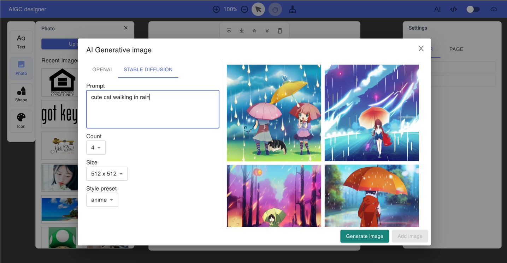

AIGC designer
==

> AI powered brand/postcard designer



## Requisite

- nvm (optional, convenient to install nodejs)
- nodejs v14
- yarn/npm (prefer yarn)

**Important note:**  

Due to Vercel deployment build `node-canvas` throw `zlib` error, 
[see thread](./docs/vercel-build-canvas-failed.md), so downgrade nodejs to v14 and use node-canvas as `2.6.0`.

For other deployment runtime, it's better to use latest nodejs.

## Develop

```bash
git clone https://github.com/sunnywx/aigc-designer.git

# copy .env.example to .env
cp .env.example .env

# based on .nvmrc to install certain nodejs
nvm use

# install latest npm/yarn 
npm i npm yarn -g

yarn
yarn dev

# open browser, http://localhost:3777
```

### .env configuration

| Name                     | Value (example)       | Description                |
|:-------------------------|:----------------------|:---------------------------|
| OPENAI_API_KEY           | sk-xxx                | OpenAI api key             |
| STABLE_DIFFUSION_API_KEY | sk-xxx                | Stable Diffusion api key   |
| HTTP_PROXY               | `http://127.0.0.1:8118` | Local http/https proxy url |


`HTTP_PROXY` is your local http proxy config (For example, use `privoxy` or `polipo` to setup http proxy), 
used on some network environment where can't access openai's service directly(Like, mainland China). 
Leave it empty if your network can access `ChatGPT` directly.

## Build

```shell
yarn build
yarn start
```

## AI text-to-image models

- OpenAI (default)
- Stable-Diffusion (optional)

## Deploy

- Vercel (default)
- Docker-compose
- AWS serverless


## License
MIT
